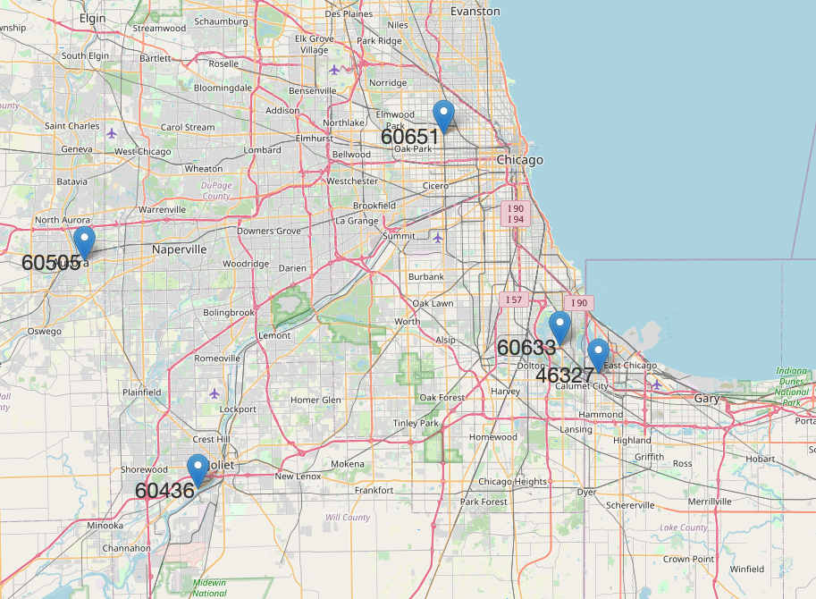
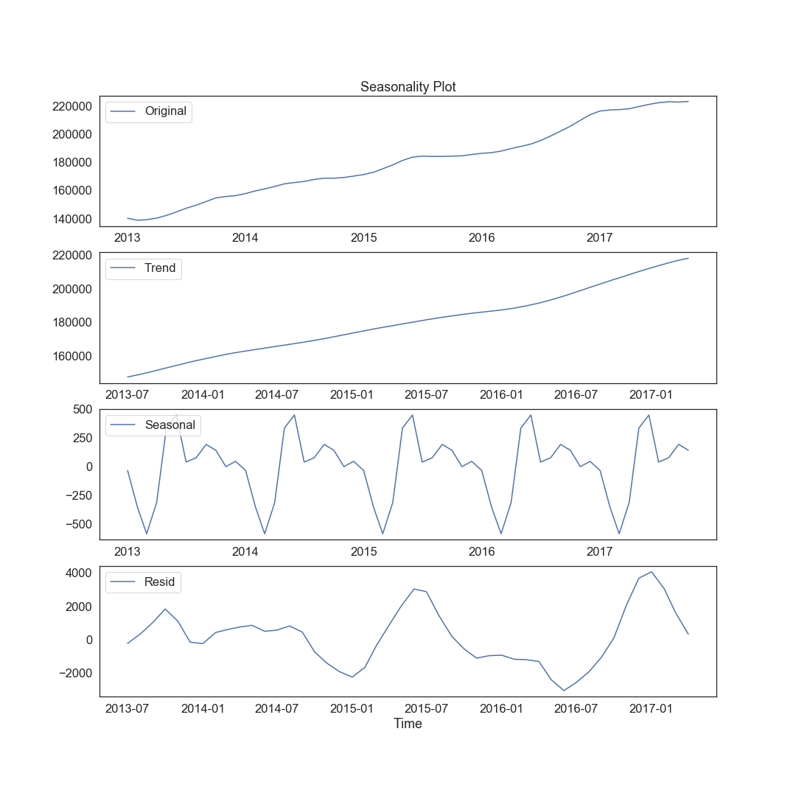
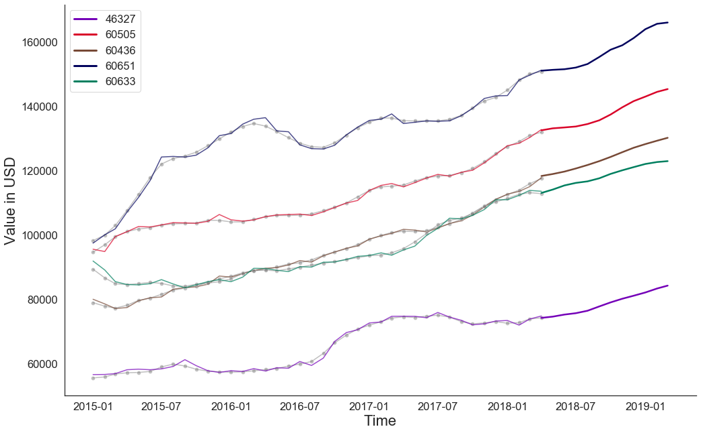
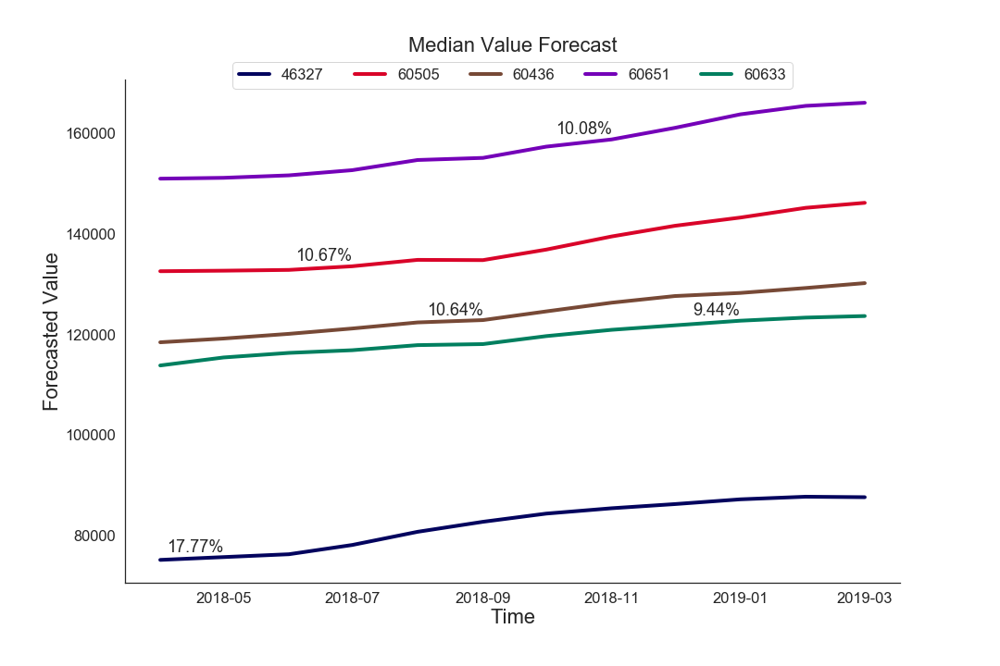

Prior to running any of the Jupyter Notbooks or data in this download the neccesary files and create the environments found within them.

# General Setup Guide:

Download [Andaconda](https://docs.anaconda.com/anaconda/install/) to be able to install the environment and use your preference of commandline options or Editor to view the data.

### From the list options below choose the environments within this neccesary envrionment for your operating system.

For Apple/Mac product user:

[`envrionment.yml`]

For windows/Linux users:

[`realestate.yml`]

To utilize Geopandas:

[`geopandas.yml`]

All files are located in the main directory and src folder.

# Directories of Project

### [Data](https://github.com/mattcarr17/time_series_project/tree/master/data): A directory that contains all of the data used for exploration and analysis.

### [Notebooks](https://github.com/mattcarr17/time_series_project/tree/master/notebooks): Directory that holds all of the notebooks used for data exploration and analysis.

### [References](https://github.com/mattcarr17/time_series_project/tree/master/references): This directory has all of the outside resources and helpful information [pertaining] to models and over all data analysis methodology.

### [Report](https://github.com/mattcarr17/time_series_project/tree/master/report/figures): Final notebook of the data analysis and PDF presentaion of the overall project.

### [[Src]](https://github.com/mattcarr17/time_series_project/tree/master/src): The modules/functions creater to aid in the data cleaning and analaysis process.

 # Overview of Project
 For this project the main objective was to analyze the given Zillow dataset and select the 5 best zipcodes based  on a particular metric. This will help investors and other individuals select profitables ways to increase their portfolio or overall income. For this project to a succes we need to accrurately predict the direction a housing price will head and have minimal error or risk for potential investors.

 # Preview of Results

 Above you can see the five zip codes we believe to be the best investment opportunities within the Chicago Metropolitan area. The remainder of this document will run through the steps we took to come to these conclusions.
 
# Methodoly of the Project and Data Analysis:

### Data gathering

The overal all approach to the data set was the CRISP-DM data mining process. To start out the CRISP-DM methodology we gathered by visiting this website [Website to download the Housing Data](https://www.zillow.com/research/data/). To obtain the same data used in this project, go under the Home Value section. The categories are ZHVIAll Homes. Geography is by Metro & US.

# Data understanding
This is where the exploratory data analysis occurs. We began by looking at all of the zipcodes and determined there were a lot of of zipscodes with their own unique characteristics. We decied to focus our efforts on one area. The chosen area was the Chicago metroolitian area. From those zip codes we need to filter it once more to select the one withs the most potential for being profitable. To do this we calculated the 5 Year return on investment(ROI) and the 2 year ROI. We then comparied the two sets of data and took the top zips codes that occrued within the 30 of both filters. 

We also looked into the data's time ranges and noticed there were NaN values in the earlier years dating in the 1996's and on. The next step we took was to filter the date's time zones. We decided to exclude data that was observed prior to 2013. This was due to the prior missing NaN values as well as the market crash of 2008. The was not a restabalization of the housing market until early 2013 based on the data set. After filtering the data for useful median house values and data ranges we were then ready to processing the data.

# Data Processing
The original dataset contained data on nearly fifteen thousand zip codes. It was clear that this was going to be too much to analyze given our time constraints, so we decided to focus our analysis on the zip codes within the Chicago Metropolitan area. Using the column "Metro", we were able to subset our dataset to only include these zip codes, which brought us to 325 zip codes to analyze. 

Considering that our analysis was trying to determine the best zip codes to invest in, we really only wanted to focus on those that would make investors the most money. For that reason, we filtered our data again using the historical five year and two year return on investment of each zip code. We calculated the ROI for these two time frames for each zip code in our filtered dataset, and used this to determine the thirty zip codes that may represent the best investments. The formula we used to calculate the ROI is as follows: ((Current value - past value) / past value) * 100. This calculates the ROI as a percentage, which was an important aspect of our analysis. If we were to use the absolute ROI, those zip codes that were valued higher would have largest absolute return, but may not produce the largest return relative to the initial investment.

After finding the historical two year and five year ROI, we found the top fifteen zip codes according to each metric. We then compared the resulting zip codes and found that there were three zip codes that were present in both subsets. We accounted for this repititon, and proceeded with the twenty-seven unique zip codes resulting from the two subsets.

# Data Modeling
The purpose of our modeling was to determine the future ROI of each zip code in our subset, and from this, determine the top five to invest in. To guage the potential value of a zip code, we took two things into consideration. First, we could only recommend a zip code if were confident in its model's forecast. For this reason we only recommended a zip code if the model we used to forecast it's future value, produced an RMSE of less than 2,500 on the testing split. Second, once we had the zip codes which model's predictions we could trust, we find the zip codes that would produce the highest ROI based on the model's forecast. These are the zip code's which we recommend to investors.

We began by creating a baseline model for a single zip code. We took into account that the 2008 housing crash may inhibit the results of our models, so we created a baseline model using the entire time series, and compared this model's results with a model using data from 2013 onward. 2013 was the year all of the zip codes seemed to begin recovering from the 2008 event. The results were rather obvious. When using the entire dataset, our models were much worse, producing an average AIC of about 4,000. In comparison, the model's used on the subset of the time series produced an average AIC of about 1,000. For this reason, we decided to create our models using the data beginning in January of 2013.

Once our basline model's were created, we began to create more complex models in order to obtain the most accurate forecasts possible. During our exploration of the data, we found a subtle seasonality in the time series. There was a recurring pattern every twelve months. Although, it was a small cycle, it still had an effect on the models, so we decided to use a SARIMA model to take this seasonality into account. You can see from the plot below that pattern repeated on a twelve month time frame. The values in the original plot and the trend plot are much larger than those in the seasonlity plot, indicating the seasonality did not impact the time series very much. Nonetheless, it was present and in order to produce trustworthy prediction, we took them into account.

We performed a manual grid search on the model for each of the zip codes, while holding the seasonality parameter constant at 12. We varied the parameters p, d, and q with values ranging from 0 to 2. Once we obtained the parameters that produced the best model for a given zip code, we stored them in a list to be used later. These model's were fit on the training data for each respective zip code. To judge the accuracy of these model's, we obtained the RMSE of the test predictions for each zip code. There were 27 in all, and 18 produced a testing RMSE of under 2,500. These were the model's we considered to produce trustworthy predictions, and therefore were the model's we decided to proceed with.

After we had the 18 zip codes that we believed could produce an accurate forecast, we retrained and retuned each model on the entire dataset (January 2013 - April 2018). We were then able to forecast for twelve months into the future, to obtain a potential ROI for each zip code. We did this by forecasting the value of each zip code for twelve months into the future (forecast of twelve steps). Once we had the values for each step in the forecast, we could use the final value (step 12) to compute the twelve month ROI similar to what we did earlier with historical ROI. We used the final value of the dataset (April 2018) and final value of forecast (March 2019) to compute ROI with the same formula as before ((future value - past value) / past value) * 100.

The plot above show's the five zip codes that will produce the highest ROI based on their respective forecasts. The dotted lines in the plot represent the actual values, the thin lines over the dotted shows how the model fit to the data, and the thick lines at the end are the model's forecasts. You can see from the plot above each of the five model's was able to fit to the data extremely well. This made us confident in each of these model's predictions.

# Final Results

The plot above shows just the forecast of each model as well as the percentage ROI for each zip code forecasted. You can see that each zip code will produce an ROI of close to 10%. The lowest is 9.44%, which is still a great twelve month return on investment, and the largest being 17.77%. You can also see from the plot above that the different zip codes have a wide range of value. This means that investors who may not have a lot of starting capital could still enter the market with one of the cheaper zip codes.

Since our forecasts were for past dates, we were able to compare our model's predictions with the actual value of each of these zip codes in today's markets. Our predictions seemed to line up with the current values, which make us even more confident in our recommendations.

# Next steps

To continue our analysis, we would like to look at more zip codes outside of the Chicago area. This would allow us to provide real estate investors outide of Chicago the same analysis and recommendations for zip codes to invest in. We would also like to consider additional metrics that influence investments such as risk or volatility.